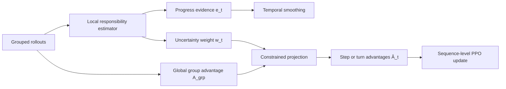
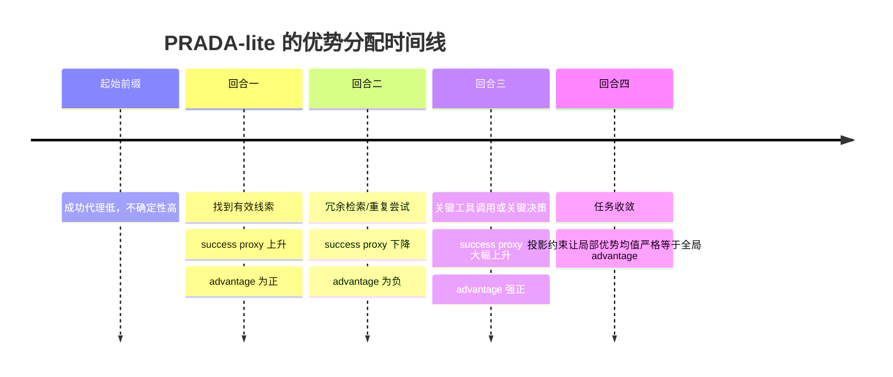

# 面向 Agentic RL 优势分配的原创研究蓝图

## 执行摘要

四篇论文共同表明，agentic RL 的核心瓶颈已从“有没有奖励”转向“如何把轨迹结果稳定、细粒度地分配成 turn 或 step advantage”。现有方法分别依赖状态分组、熵调制、不确定性控制或人工里程碑，但仍未同时解决全局一致性、长时序局部化与“无额外预测头”的不确定性估计。基于此，本文提出 **PRADA**：一种将轨迹级 advantage 投影为局部“责任 advantage”的统一框架，并建议以无需额外监督/预测头的 **PRADA-lite** 作为主投稿版本。 citeturn1view0turn13view0turn12view0turn18view2

## 四篇论文的核心方法与局限

先给出一个判断框架：这四篇论文并不处在完全同一坐标系上。GAGPO 与 BEACON 更像“结构化 credit localization”，重点是把 trajectory reward 拆向 step 或 segment；T2PO 与 AEM 更像“探索与熵动力学控制”，重点是减少低信息交互和错误的熵演化。因此，真正值得提炼的不是“谁分数最高”，而是它们分别如何定义和分配 advantage，以及各自在哪些地方仍然缺口明显。citeturn10view0turn13view0turn12view0turn18view2

| 论文 | 核心方法与数学要点 | 实验设置与代表结果 | 至少三个具体局限或未解问题 |
| --- | --- | --- | --- |
| **GAGPO** | 把环境 step 作为 credit 单位；按“相同文本状态”分组，构造非参数 grouped value proxy；以该 proxy 计算 TD residual，并用 GAE 风格递推得到 step advantage；优化时再做 group normalization 和 action-sequence importance ratio。 | 在 ALFWorld 与 WebShop 上，用 Qwen2.5-1.5B/7B 评估。1.5B 上 ALFWorld overall 为 93.5、WebShop success 为 78.1；7B 上 ALFWorld overall 为 95.6、WebShop score 为 90.3。作者还报告了更快的早期学习、更短 episode、更低 advantage variance 与更平滑梯度。 | 依赖 exact textual state match；评测域主要是文本、离散动作、稀疏终局奖励环境；时间传播超长时会显著退化，附录里把核心 temporal 超参推到 1.0 时，ALFWorld overall 降到 82.7；本质上仍要求 rollout group 在相同/可匹配状态上形成足够统计量。 |
| **T2PO** | 提出 self-calibrated uncertainty signal，把 token entropy 与 confidence 结合起来；在 token 层做 TTI，检测 reasoning 何时“不再产生新信息”并强制结束 `<think>`；在 turn 层做 TDS，对同一环境状态下信息增益不足的 turn 进行重采样。Policy update 仍然融合 trajectory-level relative advantage 与 GiGPO 的 turn-relative advantage。 | 用 Qwen3-4B/8B-RFT，在 WebShop、ALFWorld、Search QA 上评估。Qwen3-4B-RFT 下，WebShop success 81.64、ALFWorld overall 90.23；Qwen3-8B-RFT 下，WebShop success 82.42、ALFWorld overall 92.41。论文使用 8×H100，并引入 RFT、format penalty、memory context window 等整套训练配方。 | 贡献重心是探索控制，不是新的 advantage 分配原理；依赖 `<think>/<action>` 格式、RFT 冷启动与 format penalty；阈值较多，包括 monitoring window、token tolerance、turn tolerance、thinking budget、max response length 等；turn-level decomposition 会引入 off-policy staleness 风险。 |
| **Milestone-Guided Policy Learning for Long-Horizon Language Agents** | 论文方法名为 **BEACON**。它先用 milestone detector 将轨迹切成 segments，再在 segment 内做时间衰减 reward shaping，并把 trajectory-level advantage 与 segment-level advantage 线性合成：\(\hat A_{i,t}=A_i^{traj}+\lambda A_{i,t}^{seg}\)。理论上依赖“milestone 近似 Markov”来隔离后续 segment 方差。 | 在 ALFWorld、ScienceWorld、WebShop 上，用 Qwen2.5-1.5B/7B 评估。1.5B 模型下 ALFWorld avg 91.4、ScienceWorld success 45.3、WebShop success 75.6；Long-ALFWorld 子集上达到 92.9%，并把 effective sample utilization 从 23.7% 提升到 82.0%，ZAR 从接近 100% 降到约 10%。BEACON 在 8×A100 80GB 上训练，150 iterations 约需 8–10 小时。 | 依赖 task-specific milestone detector；里程碑粒度过稀会退化回 trajectory-level、过密会让 segment advantage 变噪；理论保证依赖 milestone Markov property，而论文附录明确承认 inventory limits、time constraints 等跨 segment 依赖会破坏该假设；在无显式 subgoal / 无清晰状态跃迁的环境中迁移性有限。 |
| **AEM** | 以 response span 为基本 action 单位，提出 response-level entropy geometry。其核心理论结论是：在 frozen rollout distribution / fixed occupancy 假设下，entropy drift 由 sampled-response advantage 与 relative response surprisal 的相互作用决定。实现上用长度归一化的 response entropy proxy，经组内 min-max 标准化和单调下降映射得到 modulation coefficient，再把其**统一**乘到该 response 的 base advantage 上。 | 在 ALFWorld、WebShop、SWE-bench-Verified 上验证。以 Qwen2.5-1.5B 为例，AEM 在 GRPO 上把 ALFWorld avg 从 68.0 提到 76.8、WebShop success 从 65.0 提到 70.6；在 Qwen3-32B 的 DeepSWE 设定中，把 SWE-bench-Verified 从 42.3% 提到 43.7%。AEM 自身额外计算仅约 1.1%。 | 相对响应 surprisal 在开放式 LLM policy 下不可直接计算，实际落地依赖 group-based entropy proxy；只给整个 response 一个统一系数，无法精确定位 response 内部 detour 与关键 token/step；理论核心依赖 frozen rollout distribution 假设；效果与 rollout group 质量和 group normalization 强相关。 |

表中整理综合自四篇原论文、附录与实验页。citeturn10view0turn10view4turn9view4turn9view0turn13view0turn13view2turn13view1turn12view0turn12view1turn12view2turn17view2turn8view0turn8view2turn8view1turn18view0turn18view2turn7view3

如果进一步压缩成“优势分配视角下的差异”，四篇论文可以更清楚地放在同一张表里看。

| 维度 | GAGPO | T2PO | BEACON | AEM |
| --- | --- | --- | --- | --- |
| **advantage 估计/分配单元** | step | turn 与 token 上做控制，但 advantage 仍融合 trajectory-level 与 GiGPO turn-relative | segment + trajectory 双尺度 | response 级统一缩放 |
| **核心探索策略** | 无显式探索控制，依靠时序 credit 更稳 | TTI + TDS 显式控制“何时停想、何时重采样回合” | milestone shaping 间接改善探索 | 用熵调制形成 early explore / late exploit |
| **不确定性处理** | 无显式 uncertainty 模块 | 自校准 uncertainty signal | 无显式 uncertainty，主要靠结构信号 | response entropy / surprisal proxy |
| **长时序依赖处理** | GAE-style temporal recursion | turn decomposition + uncertainty-guided regeneration | 里程碑分段 + dual-scale advantage | 无显式分段，主要靠 response-level entropy dynamics |
| **样本效率证据** | 更快早期学习、更短 episode、更低方差 | 更少冗余 token / turn，更低 collapse 风险 | effective sample utilization 23.7%→82.0%，ZAR 大幅下降 | 几乎无额外开销，跨 backbones 稳定增益 |
| **稳定性证据** | 更平滑梯度与 advantage 分布 | 方差更低、受 stale policy 影响有限 | 更快收敛、entropy 下降更平滑 | 抑制早期 entropy collapse |
| **最核心短板** | exact match 依赖强 | 不是新的 advantage 原理 | milestone detector 依赖强 | response 内部 credit 仍然粗粒度 |

这张对比表对应的事实分别来自四篇论文的方法与实验节，且可以看出：当前工作还没有谁能同时做到“无人工里程碑、无 exact match、带不确定性、且全局一致的局部 advantage 分配”。citeturn10view0turn10view4turn13view0turn13view1turn12view0turn12view2turn17view2turn18view2turn8view0

## 横向比较与研究空白

从上述局限出发，至少有四条可投稿顶会的改进方向，而且它们都不是把现有技巧简单叠加就能解决的。

| 可改进方向 | 核心矛盾 | 为什么现有方法不能直接解决 |
| --- | --- | --- |
| **语义鲁棒的局部进度建模** | 真实 agent 任务往往没有 exact state recurrence，也没有人工可写的 milestone。 | GAGPO 依赖 exact match；BEACON 依赖 detector；T2PO/AEM 都没有直接刻画“任务进度”本身。 |
| **面向终局成功后验的不确定性** | token/response entropy 高，不等于“对最终成功真的不确定”。 | T2PO/AEM 的 uncertainty 更接近分布熵与 surprisal，而不是终局成功后验；GAGPO/BEACON 基本不显式建模 uncertainty。 |
| **全局一致、局部可变号的 advantage 分解** | 好的优势分配要能在成功轨迹内部惩罚 detour，在失败轨迹内部保留局部好动作。 | AEM 只做 response 级统一缩放；T2PO 本质还是在原 advantage 上做探索控制；BEACON 只有在 milestone 条件下才有局部 signed credit；GAGPO 可 step-localize 但缺乏 uncertainty-aware global correction。 |
| **不引入额外监督/预测头的责任估计** | 审稿人往往会追问：是否必须再训练一个 prefix success model？这会不会引入新的不稳定性和算力成本？ | 现有四篇工作里，GAGPO/BEACON 不做这件事，T2PO/AEM 的 uncertainty 也不是为“责任投影”设计的；因此没有现成方案可直接挪用。 |

这四个方向背后的共同空白是：**还缺一个把“局部证据”“全局结果”“不确定性修正”统一起来的 advantage 分配算子**。这不是 AEM 再加一个时间衰减，也不是 GAGPO 再加一个熵项；它需要重新定义“trajectory-level outcome 如何投影为局部优势”。citeturn9view0turn9view6turn13view0turn13view1turn12view2turn11view3turn11view5turn18view2turn8view1

## 原创研究设想

我建议的原创方向命名为：

**PRADA: Projection-based Responsibility Advantage Decomposition for Agentic RL**

这里的核心创新不是某个单独的 uncertainty signal，而是一个新的 advantage 分配原理：**把轨迹级 advantage 的分配视为“局部责任证据”与“全局结果约束”之间的最优投影问题。**

**问题陈述。** 设同一任务 prompt 下采样到 rollout group \(G=\{\tau_i\}_{i=1}^N\)。对每条轨迹 \(\tau_i\)，终局 reward 是 \(R_i\)，但我们真正需要的是 turn/step 级的 \(\hat A_{i,t}\)。现有方法不是把所有 step 共享同一 global offset，就是依赖人工 milestone 或粗粒度 response entropy。PRADA 的目标是：在不改变 RL backbone 的前提下，把 \(A_i^{grp}\) 稳定、可解释地拆成 \(\hat A_{i,1:T_i}\)，并保证这些局部 advantage 的均值与全局结果严格一致。

**统一记号。** 对每条轨迹先定义 rollout-group advantage：
\[
A_i^{grp}=\frac{R_i-\mu_G}{\sigma_G+\epsilon},
\qquad
\mu_G=\frac1N\sum_{j=1}^N R_j.
\]

然后，为每个 step 或 turn 构造两个量。第一是局部责任证据 \(e_{i,t}\)，表示“第 \(t\) 步是否让成功更近”；第二是不确定性 \(s_{i,t}^2\)，表示“这份局部证据到底可靠不可靠”。

PRADA 的通用局部证据写成：

\[
e_{i,t}
=
\phi_{i,t}-\phi_{i,t-1}
+
\lambda_u \,\mathrm{sign}(A_i^{grp})\,(u_{i,t-1}-u_{i,t}),
\]
其中 \(\phi_{i,t}\) 是某种“成功进度”表征，\(u_{i,t}\) 是其不确定性。这个写法统一了后面所有变体：PRADA-full 里的 \(\phi\) 来自 learned posterior，PRADA-lite 里的 \(\phi\) 来自 rollout bootstrap proxy，PRADA-lite2 里的 \(\phi\) 来自 selective ensemble rollouts。也就是说，**真正的贡献不在“你拿什么测局部进度”，而在“你如何把它变成 globally consistent advantage”。**

**长时序处理。** 为了让 delayed effect 向前传播，但又避免纯 MC return 的高方差，PRADA 对局部证据做 trace smoothing：

\[
\tilde e_{i,t}
=
\sum_{u=t}^{T_i}(\gamma_\rho \lambda_\rho)^{u-t} e_{i,u}.
\]
它传播的不是 reward，而是“责任证据”。这与 GAGPO 的 bootstrapped temporal advantage 有相似的时间传播结构，但传播对象已从 grouped value residual 变成了 success-responsibility evidence；与 BEACON 不同，它不要求显式 segment 或 milestone。citeturn10view0turn10view4turn12view0

**优势分配机制的数学定义。** PRADA 的核心是下面这个受约束投影：

\[
\hat{\mathbf A}_i
=
\arg\min_{\mathbf a\in \mathbb R^{T_i}}
\sum_{t=1}^{T_i}
\frac{(a_t-\tilde e_{i,t})^2}{2(s_{i,t}^2+\epsilon)}
\quad
\text{s.t.}\quad
\frac1{T_i}\sum_{t=1}^{T_i} a_t=A_i^{grp}.
\]

这一定义有非常明确的解释。目标函数要求最终 advantage \(a_t\) 尽可能接近局部责任证据 \(\tilde e_{i,t}\)；但局部证据与全局结果之间可能不一致，因此我们要求它们的平均值必须正好等于 \(A_i^{grp}\)。同时，若某一步不确定性高，那么偏离局部证据的代价就更低，于是全局修正会更多落在“不太确定的地方”。

这个问题有闭式解。令

\[
w_{i,t}=s_{i,t}^2+\epsilon,
\]
构造拉格朗日函数：

\[
\mathcal L(\mathbf a,\lambda)
=
\sum_t \frac{(a_t-\tilde e_{i,t})^2}{2w_{i,t}}
+
\lambda\left(\sum_t a_t - T_i A_i^{grp}\right).
\]
一阶条件给出

\[
a_t=\tilde e_{i,t}-\lambda w_{i,t}.
\]
代回约束得到

\[
\lambda
=
\frac{\sum_u \tilde e_{i,u}-T_iA_i^{grp}}{\sum_u w_{i,u}},
\]
因此

\[
\boxed{
\hat A_{i,t}
=
\tilde e_{i,t}
+
w_{i,t}\,
\frac{T_iA_i^{grp}-\sum_{u=1}^{T_i}\tilde e_{i,u}}
{\sum_{u=1}^{T_i}w_{i,u}}
}
\]

这个闭式解给出两条可以写进论文主文的命题。

其一，**全局一致性**：  
\[
\frac1{T_i}\sum_t \hat A_{i,t}=A_i^{grp}.
\]
这意味着 PRADA 的局部 advantage 与 trajectory-level outcome 从定义上就不会漂移。

其二，**不确定性选择性修正**：如果 \(\sum_t \tilde e_{i,t}\neq T_iA_i^{grp}\)，那么修正项的绝对值与 \(w_{i,t}\) 成正比。直观地说，PRADA 会优先在高不确定 step 上做“全局纠偏”，而不是像 trajectory reward broadcast 那样无差别平铺到所有 step。这个性质正是现有四篇论文都没有统一保证的。citeturn10view4turn12view0turn18view1

**策略优化目标。** 一旦有了 \(\hat A_{i,t}\)，actor 更新仍可使用标准 clipped objective；若 action 是多 token span，则建议采用 sequence-level ratio，使一个 step advantage 与完整 action 边界一致：

\[
\mathcal L_{\pi}
=
\mathbb E\left[
\min\left(r_{i,t}\hat A_{i,t},
\mathrm{clip}(r_{i,t},1-\epsilon_c,1+\epsilon_c)\hat A_{i,t}\right)
\right]
-\beta\,\mathrm{KL}.
\]
这里的 sequence-level ratio 只是工程上更合理的 action-boundary 对齐方式，不是 PRADA 的贡献本体；PRADA 的贡献集中在 \(\hat A_{i,t}\) 的定义本身。GAGPO 也表明 action sequence-level ratio 在 step advantage 场景下比 token-wise 独立 clipping 更稳。citeturn10view1turn10view4

**为何这不是简单拼凑。** PRADA 不是 “GAGPO 的递推 + BEACON 的里程碑 + AEM 的熵调制 + T2PO 的重采样” 的拼盘。它只有一个真正新的核心对象：
\[
\mathcal P_{resp}:\left(A_i^{grp},\{\tilde e_{i,t},s_{i,t}^2\}_{t=1}^{T_i}\right)\mapsto \{\hat A_{i,t}\}_{t=1}^{T_i}.
\]
里程碑、exact match、entropy、resampling 都只是在不同实现里用来估计 \((\tilde e,s^2)\) 的方式；而 **受约束责任投影** 本身是新的、可证明的、可替换信号源的 advantage 分配原理。顶会角度看，这比“再加一个 heuristic coefficient”更像真正的方法论文。

**原始 PRADA-full。** 概念上最直接的版本，是像我上一次建议的那样，训练一个 prefix success posterior 头 \(q_\phi(p_t|h_t)\) 来给出 \(\phi_t=\mathrm{logit}(\mathbb E[p_t])\) 和 \(u_t=\mathrm{Var}(p_t)\)。这一版本理论最干净，但确实会引入额外训练与一个新头；考虑到你后续明确提出“不需额外训练的替代方法”，我更建议把它降级为**上界版本/附录扩展**，并把下一节的 **PRADA-lite** 作为主投稿方法。这个取舍本身更符合 NeurIPS/ICLR/ICML 审稿对“简单、稳健、少额外模块”的偏好。

## 无需额外训练的替代策略

你指出 PRADA-full 需要 prefix success posterior，会带来额外训练与预测头依赖，这个担心非常合理。下面给出两种**不需要额外监督、也不训练新增预测头**的替代策略，并给出数学定义、优缺点、实现细节与和 PRADA-full 的比较。

| 变体 | 核心思想 | 数学定义 | 不确定性估计 | 优点 | 缺点 |
| --- | --- | --- | --- | --- | --- |
| **PRADA-full** | 学一个 prefix success posterior | \(\phi_{i,t}=\mathrm{logit}(\mu_{i,t})\)，\(u_{i,t}=v_{i,t}\) | posterior variance | 理论最直接；可做校准分析 | 需要额外训练头；多目标优化可能增加不稳定性 |
| **PRADA-lite** | 用 **回溯一致性 bootstrap 成功率代理** 代替 posterior head | 基于 rollout group 中相似 prefix 的终局成功率，非参数估计 \(\hat p_{i,t}\) | bootstrap 方差 / 有效样本数 | 无额外监督、无新头、可直接嵌入现有 RL 框架；与 PRADA 核心投影完全兼容 | 需要足够多样的 rollout group；neighbor quality 决定上限 |
| **PRADA-lite2** | 用 **选择性 ensemble rollout reweighting** 直接从同一状态继续采样多个 suffix | \(\hat p_{i,t}=K^{-1}\sum_{k=1}^K R_{i,t}^{(k)}\) | suffix return 方差 | 最接近真实“从当前状态继续会不会成功” | 需要额外环境 rollouts；若对所有 steps 都做会很贵 |
| **可选诊断版** | 用 counterfactual perturbation probe 做评估或 teacher signal | \(\Delta_t=\hat P(R=1|h_t,a_t)-\hat P(R=1|h_t,\tilde a_t)\) | 备选动作与 continuation 方差 | 最接近局部因果贡献 | 更适合评估/蒸馏，不适合作为默认训练路径 |

这张表中的 PRADA-lite 与 PRADA-lite2 都不需要额外监督或预测头；它们与 PRADA-full 的区别，不在 advantage 投影本体，而只在 \((\phi_t,u_t)\) 的估计方式。也因此，这两种 no-head 方案不是对原 idea 的否定，而是对其更实用的实例化。citeturn13view1turn18view4turn11view3

我建议的**首选替代策略**是 **PRADA-lite**。原因很简单：它比 PRADA-lite2 省算力，又比 AEM/T2PO 更直接面向 “成功后验责任” 而不是表面 entropy；同时它不需要像 GAGPO 那样 exact state matching，也不需要像 BEACON 那样显式里程碑。下面给出它的完整定义。

**PRADA-lite 的回溯一致性 bootstrap。** 对 rollout group 中第 \(i\) 条轨迹的第 \(t\) 个 prefix \(h_{i,t}\)，取一个**冻结表示** \(z_{i,t}=f(h_{i,t})\)。这个 \(f\) 不训练新增头，只复用当前策略模型或冻结底模的最后层 hidden state 压缩、句向量、或 observation-action 拼接后的 pooled representation。然后定义同一 prompt/task 内的近邻权重：

\[
\omega_{i,t}^{j,u}
=
\exp\!\left(\frac{\cos(z_{i,t},z_{j,u})}{\tau}\right)
\mathbf 1[|u-t|\le \Delta].
\]
这里 \(\Delta\) 是一个 temporal band，避免把过早 prefix 与过晚 prefix 胡乱匹配。

接着，用带平滑先验的非参数成功率代理：

\[
\hat p_{i,t}
=
\frac{\alpha_0 + \sum_{j,u}\omega_{i,t}^{j,u}R_j}
{\alpha_0+\beta_0+\sum_{j,u}\omega_{i,t}^{j,u}}.
\]
它可以被理解成“与当前 prefix 语义相近的历史 prefix，最终成功的经验频率”。注意，这里用的是**现成 rollout group 的终局成功标签**，没有任何新监督。

为了估计不确定性，不训练头，而是直接做 bootstrap。设 \(\mathcal N_{i,t}\) 是 top-\(K\) 近邻集合，重采样 \(B\) 次：

\[
\hat v_{i,t}
=
\mathrm{Var}_{b=1}^{B}\big(\hat p_{i,t}^{(b)}\big).
\]
于是 PRADA-lite 的局部责任证据可写为

\[
e_{i,t}^{lite}
=
\underbrace{\mathrm{logit}(\hat p_{i,t})-\mathrm{logit}(\hat p_{i,t-1})}_{\text{success-like progress}}
+
\lambda_u\,\underbrace{\mathrm{sign}(A_i^{grp})\left(\hat v_{i,t-1}-\hat v_{i,t}\right)}_{\text{outcome-aligned uncertainty resolution}}.
\]
这一步非常关键：如果一个动作让“成功样前缀”的相似度上升、同时不确定性下降，那么它在正样本轨迹中应当得到更大正 advantage；反之，如果它让 prefix 更像失败轨迹，或者把系统带到更混乱的位置，就应当被压低，甚至在最终成功轨迹里也可能变成负 advantage。

**PRADA-lite 的闭式投影。** 在 PRADA-lite 中，令

\[
w_{i,t}=\hat v_{i,t}+\epsilon,
\qquad
\tilde e_{i,t}=\sum_{u=t}^{T_i}(\gamma_\rho\lambda_\rho)^{u-t}e_{i,u}^{lite}.
\]
然后解

\[
\min_{\mathbf a}
\sum_t \frac{(a_t-\tilde e_{i,t})^2}{2w_{i,t}}
\quad
\text{s.t.}\quad
\frac1{T_i}\sum_t a_t=A_i^{grp},
\]
得到

\[
\boxed{
\hat A_{i,t}^{lite}
=
\tilde e_{i,t}
+
w_{i,t}\,
\frac{T_iA_i^{grp}-\sum_{u}\tilde e_{i,u}}
{\sum_{u}w_{i,u}}
}
\]
这就是首选 no-head 版本的闭式解。它完全保留了 PRADA 的全局一致性约束，同时用 bootstrap variance 替代 posterior variance，因而不需要新增预测头。

**PRADA-lite2 的 ensemble rollout reweighting。** 若算力允许，可以在高不确定 steps 上做 selective branching。对状态 \(s_{i,t}\) 采样 \(K\) 个 suffix：

\[
\hat p_{i,t}^{ens}
=
\frac1K \sum_{k=1}^{K}R_{i,t}^{(k)},
\qquad
\hat v_{i,t}^{ens}
=
\frac1{K-1}\sum_{k=1}^{K}\left(R_{i,t}^{(k)}-\hat p_{i,t}^{ens}\right)^2.
\]
然后与 PRADA-lite 共享同一投影算子。这个版本更接近“真实 continuation success probability”，但计算代价明显更高，因此更适合作为中高资源 setting 的强基线或上界。

**与 PRADA-full 的关系。** PRADA-full 与 PRADA-lite 的差别，只是 \(\hat p_t\) 从 learned posterior 变成了 nonparametric bootstrap proxy。投影本体、全局一致性约束、以及不确定性选择性修正全部保留。因此，如果审稿人质疑新增预测头的必要性，我们可以非常明确地回答：**不是必要条件，PRADA 的核心贡献并不依赖新头。**

下面给出更新后的 **PRADA-lite** 伪代码，它明确替换了 posterior head 相关步骤。

```text
Algorithm PRADA-lite
Input:
  rollout group G = {τ_i}, terminal rewards {R_i},
  frozen prefix encoder f, top-K neighbors K, bootstrap rounds B,
  trace factors γρ, λρ
Output:
  step/turn advantages {Â_i,t}

1. Collect grouped rollouts under the same prompt/task
2. Compute trajectory-level group advantage:
      A_i^grp = (R_i - mean_G(R)) / (std_G(R) + ε)

3. For each trajectory i and prefix h_i,t:
      z_i,t = f(h_i,t)                      # reuse hidden states or frozen embeddings
      Retrieve top-K neighbor prefixes N_i,t within same task and temporal band
      For b = 1...B:
          Resample N_i,t with replacement -> N_i,t^(b)
          Compute p_i,t^(b) =
              (α0 + Σ_(j,u in N_i,t^(b)) ω_i,t^(j,u) R_j) /
              (α0 + β0 + Σ_(j,u in N_i,t^(b)) ω_i,t^(j,u))
      Set p̂_i,t = mean_b p_i,t^(b)
      Set v̂_i,t = var_b p_i,t^(b)

4. Compute local responsibility evidence:
      e_i,t = [logit(p̂_i,t) - logit(p̂_i,t-1)]
              + λu * sign(A_i^grp) * (v̂_i,t-1 - v̂_i,t)

5. Backward smooth evidence:
      ē_i,t = Σ_(u=t)^T (γρ λρ)^(u-t) e_i,u

6. Closed-form constrained projection:
      Â_i,t = ē_i,t + (v̂_i,t + ε) / Σ_u(v̂_i,u + ε)
                    * (T_i A_i^grp - Σ_u ē_i,u)

7. Normalize  within same prompt group
8. Update actor with sequence-level clipped objective using Â
```

## 实验蓝图

实验设计上，我建议把整篇论文分成两个 protocol。**Protocol A** 是统一 backbone、公平对比 advantage 分配；**Protocol B** 是 paper-native recipe，测试与 T2PO/AEM 这类正交模块的兼容性。这样更严谨，因为 T2PO 使用 RFT、format penalty、special tags、memory context window 和 8×H100，而 GAGPO/BEACON/AEM 则主要围绕 veRL / verl-agent / vLLM 的 grouped RL 生态展开。citeturn13view2turn6view2turn12view2turn20view0turn19view3

**任务选择。** 长时序语言代理任务建议至少包含 ALFWorld 与 ScienceWorld；多回合 agentic 任务建议包含 WebShop 与 Search QA；高资源扩展可加入 SWE-bench-Verified。ALFWorld 是文本化 embodied task；WebShop 含 1.18M 真实商品与 12,087 条众包指令；ScienceWorld 覆盖 30 个科学任务；T2PO 使用的 Search QA 由 NQ、TriviaQA、PopQA、HotpotQA、2Wiki、MuSiQue、Bamboogle 等多数据集组成；SWE-bench Verified 是人工验证的 500 个软件问题子集。citeturn15view0turn15view1turn15view2turn6view3turn16search1turn15view3

| 实验组 | 环境/数据 | 任务属性 | 推荐 backbone | 主要对比方法 | 关键指标 |
| --- | --- | --- | --- | --- | --- |
| **主实验 A** | ALFWorld | 长时序、稀疏终局奖励、离散环境动作 | Qwen2.5-1.5B / 7B | GRPO、GiGPO、GAGPO、BEACON、AEM、PRADA-full、PRADA-lite、PRADA-lite2 | Success Rate、AUC-env-turn、Advantage Variance、Global Consistency Error |
| **主实验 B** | ScienceWorld | 更长时序、组合科学推理、子实验依赖 | Qwen2.5-1.5B / 7B | GRPO、BEACON、AEM、PRADA-full、PRADA-lite、PRADA-lite2 | Success、Score、Zero-Advantage Ratio、Credit Correlation |
| **主实验 C** | WebShop | 多回合网页代理、搜索-比较-购买 | Qwen2.5-1.5B / 7B；Qwen3-4B/8B 可做附录 | GRPO、GiGPO、GAGPO、AEM、T2PO、PRADA 系列 | Task Score、Success、每成功样本 token/turn 数、Detour Precision |
| **主实验 D** | Search QA | 多回合 search agent、短中时序、工具调用 | Qwen3-4B / 8B | Search-R1 setting、T2PO、AEM、PRADA-lite、PRADA-lite2 | EM/F1、平均检索步数、成功率、Prefix Proxy Calibration |
| **扩展实验** | SWE-bench Verified | 开放域软件代理、超长 horizon、真实验证 | Qwen3-32B | DeepSWE、DeepSWE+AEM、PRADA-lite2 | Resolved Rate、pass@1、轨迹长度、counterfactual credit probe |

这张实验矩阵有一个重要设计点：**T2PO 应该既作为 baseline，也作为可叠加模块。** 因为 T2PO 的核心是探索控制，理论上与 PRADA-lite 这类 advantage operator 正交。也就是说，主表比较“谁的 advantage 分配更好”时，T2PO 是 baseline；附表可以测试 “T2PO + PRADA-lite” 是否进一步受益。citeturn13view0turn5view0

**评价指标。** 建议把指标分成五层。第一层是任务成败：ALFWorld/ScienceWorld 看 success 或 score，WebShop 看 task score 与 success，Search QA 看 EM/F1，SWE-bench Verified 看 resolved rate。第二层是样本效率：AUC-env-turn、达到固定 success 阈值所需的 rollout turns、平均每成功样本 token 数。第三层是优化稳定性：梯度范数、policy entropy、advantage variance、IQR、ZAR。第四层是 credit quality：  
\[
\text{CCC}=\mathrm{Spearman}(\hat A_t,\Delta_t^{cf}),
\]
其中 \(\Delta_t^{cf}\) 是 counterfactual continuation 对最终 reward 的边际影响；  
以及
\[
\text{GCE}=\left|A_i^{grp}-\frac1{T_i}\sum_t \hat A_{i,t}\right|,
\]
它对 PRADA 系列应接近 0。  
第五层是“detour 识别能力”：在成功轨迹中，对经 counterfactual probe 证实为冗余/绕路的 step，统计被赋予负 advantage 的比例。这样论文就不只是“最后分数更高”，而是能证明“credit 真的更合理”。

**消融实验。** 我建议主文至少保留以下消融。

| 消融项 | 目的 | 预期现象 |
| --- | --- | --- |
| 去掉投影约束，仅用 \(\tilde e_t\) | 检验 global consistency 是否必要 | 最终分数和 credit probe 都下降，GCE 明显增大 |
| 去掉 uncertainty 权重，改为均匀纠偏 | 检验 uncertainty-selective correction | detour 精度下降，成败混杂轨迹更不稳 |
| 去掉 trace smoothing | 检验长时序责任传播 | ALFWorld/ScienceWorld 下降幅度大于 WebShop |
| PRADA-full vs PRADA-lite | 检验新增预测头是否必要 | lite 若接近 full，将非常有说服力 |
| PRADA-lite vs PRADA-lite2 | 检验 bootstrap proxy 与 selective branching 的 trade-off | lite2 可能稍强但更贵 |
| semantic KNN vs exact-match neighbor | 检验是否摆脱 GAGPO 式 exact match 依赖 | 语义邻域在开放域任务更稳 |
| 与 T2PO 结合 | 检验 advantage 分配与探索控制是否正交 | 在 WebShop / Search QA 上最可能进一步提升 |

**超参数建议。** 主投稿可以采用一套相对保守的共享超参：\(\gamma_\rho=0.95\)、\(\lambda_\rho=0.8\)、\(\lambda_u\in[0.1,0.5]\)、top-\(K\)=16 或 32、bootstrap rounds \(B=16\)、temporal band \(\Delta=2\) 或 3、组内 advantage normalization 使用 prompt group。若做 PRADA-lite2，则只对 top-\(M\) 高不确定 steps 做 branching，例如每条轨迹最多 3 个 steps、每步 \(K=4\) 个 continuations。这样能把额外环境成本控制在合理范围内。

**资源估计。** 以下估计不是论文已报数，而是**参照现有工作的硬件规模推算**。T2PO 使用 8×H100；BEACON 用 8×A100 80GB，150 iterations 约 8–10 小时；AEM 在 ALFWorld/WebShop 上使用 A800、在 SWE-bench-Verified 上使用 H200，且方法自身额外耗时只有约 1.1%。因此，PRADA-lite 的资源可以分成三档。citeturn6view2turn12view2turn20view0turn7view3

| 档位 | 推荐配置 | 适用目标 | 粗略估计 |
| --- | --- | --- | --- |
| **低** | 1.5B；ALFWorld + WebShop；4×A100 80GB 或 4×H100 | 证明方法有效、跑主消融 | 1–2 天；PRADA-lite 额外开销主要来自 KNN/Bootstrap |
| **中** | 7B 或 4B/8B；ALFWorld + ScienceWorld + WebShop + Search QA；8×H100 | 论文主结果、多 seed 稳定性 | 3–6 天；PRADA-lite2 只在部分高不确定 step 上 branching |
| **高** | 32B；加 SWE-bench Verified；16×H100/H200 | 开放域扩展与强说服力演示 | 1–2 周；PRADA-lite2 更适合作为强上界 |

**成功判据。** 一个足够有顶会竞争力的论文，应至少满足四条。第一，在四个主基准里至少三个显著优于最强 baseline。第二，在 Credit Correlation、Detour Precision、GCE 这三类 credit 指标上至少两类明显优于 GAGPO/BEACON/AEM。第三，PRADA-lite 在不训练新头的情况下接近 PRADA-full。第四，T2PO+AEM 这类正交技巧即使叠加，也仍然无法替代 PRADA 的核心投影收益；否则审稿人会认为 PRADA 只是一个“可被别的 trick 覆盖”的小修补。

## 可视化建议与开放问题

这一类论文最怕只有最终 success 曲线，而看不出 advantage 分配到底“做对了什么”。因此，建议主文至少放三类图。

第一张图建议画 **算法流程图**，直接把“局部责任证据—不确定性估计—受约束投影—策略更新”讲清楚。用 Mermaid 非常合适。



第二张图建议画 **优势分配时间线**。这张图最能体现 PRADA 的卖点：同一条最终成功轨迹中，绕路 step 也可以得到负 advantage，而关键 step 会被显著放大。



第三张图建议做 **三联图**。左图是 success / EM / resolved rate 对 env turns 的曲线；中图是 advantage variance、ZAR、policy entropy 曲线；右图是 Counterfactual Credit Correlation 与 GCE。这样可以把“性能提升”“训练更稳”“credit 更合理”三件事放在同一页讲清楚。GAGPO、BEACON、AEM 都已经证明这类诊断图很有解释力。citeturn9view3turn17view2turn7view3

第四张图建议做 **优势热力图**。横轴为时间步，纵轴为轨迹，颜色为 \(\hat A_{i,t}\)。这张图尤其适合展示 PRADA-lite 与 AEM 的差异：AEM 会呈现 response span 内统一色块，而 PRADA-lite 会在同一成功轨迹内部显示“局部负块”和“关键正块”。

最后给出几个仍需在投稿时主动交代的开放问题。第一，PRADA-lite 的邻域质量依赖 prefix 表示；若表示随策略漂移过快，可能造成 bootstrap proxy 抖动。第二，PRADA-lite2 虽然更接近真实 continuation value，但若 branching 过多，计算成本会迅速上升。第三，四篇参考论文大多仍集中在文本交互环境；若要打更高分，建议把开放域软件代理或更弱结构的网页/搜索代理结果补上。第四，这四篇工作当前主要基于 2026 年 arXiv / 当前网页版论文版本，正式会议版本中公式编号和实现细节仍可能有微调，因此复现时应以最新附录和公开代码为准。citeturn1view0turn1view1turn1view2turn1view3

综合判断，如果目标是 **NeurIPS / ICLR / ICML**，最稳妥的主叙事不是推 PRADA-full，而是把 **PRADA-lite 作为主方法**：它保留了新颖的“受约束责任投影”原理，避免了新增预测头带来的审稿阻力，并且能够正面回应现有四篇论文共同没有解决的问题——**如何在无人工里程碑、无 exact match、无额外监督的前提下，把 trajectory-level outcome 分解为 globally consistent、uncertainty-aware、step-local 的 advantage。** 这正是一个足够原创、也足够可以落成论文的方法与实验蓝图。